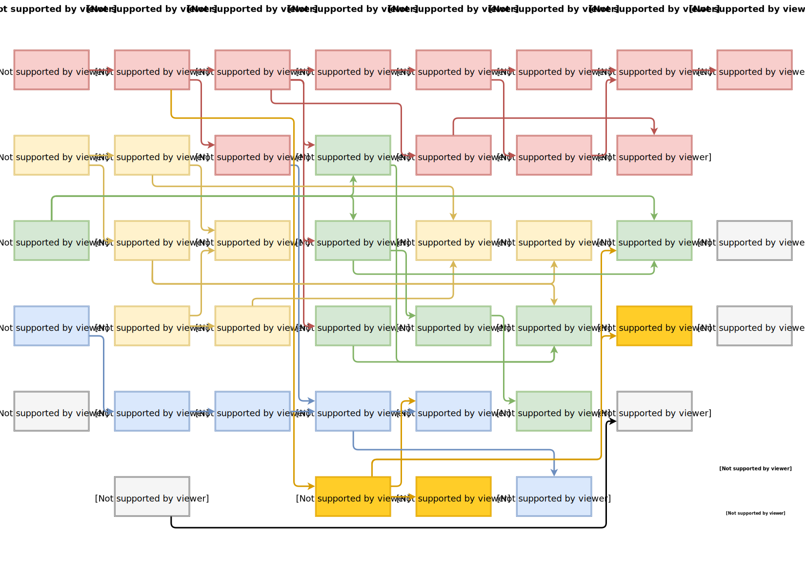

# Currículo reformulado para Ciência da Computação - UFSC
###### Desenvolvido com a colaboração de discentes :)

### Motivação:
Já há algum movimento entre os alunos do curso para atualização e melhorias no
currículo. Dentre as opiniões mais consolidadas, os alunos concordam que há um
excesso de conteúdo relacionado a engenharia de software, ao passo que há uma
quantidade muito aquém do necessário em desenvolvimento do pensamento lógico,
da variedade de conteúdo (o curso é baseado em apenas uma tecnologia de cada
tipo - uma linguagem de programação, um modelo de bancos de dados...) e nenhum
incentivo à carreira acadêmica. O currículo difere muito das universidades
mais consagradas na mesma área e curso vem aos poucos perdendo qualidade e
perdendo sua tradicional colocação entre os melhores do país e da América
Latina.

### Como será:
Primeiramente marcaremos a versão atual do currículo com um novo release neste
repositório. Mudanças serão efetuadas de acordo com opiniões mais difundidas
entre os alunos e docentes e, então, será aberta a possibilidade de enviar
propostas para serem discutidas (através das issues, e após discussão,
aprovadas). Ao fim de todas as modificações, teremos um novo currículo muito
mais apropriado ao porte do nosso curso.
